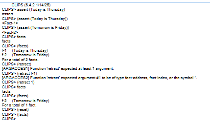
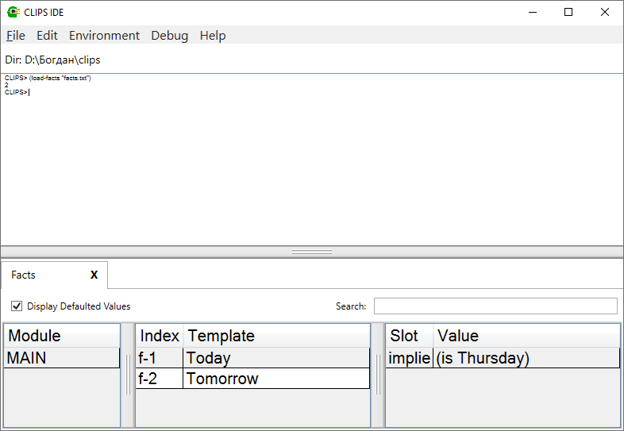
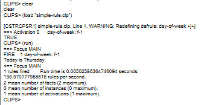
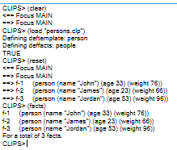
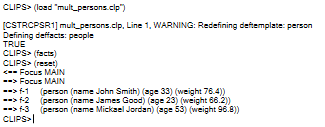
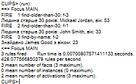

## 🧪 Лабораторна робота №1

**Тема:** Експертна система CLIPS.

### 📋 Завдання

1. **Завдання 1:** Операції з фактами (`assert`, `retract`, `facts`, `reset`).
   * Додати факти `(Today is Thursday)` та `(Tomorrow is Friday)`.
   * Перевірити правильність введення та видалити перший факт.
   * Очистити базу фактів.

2. **Завдання 2:** Формування бази фактів за допомогою списку фактів (`deffacts`, `clear`, `watch`).
   * Створити файл фактів та завантажити його через середовище.
   * Створити `.clp` файл із конструкцією `deffacts` для списку фактів `what-day-is-it?`.

3. **Завдання 3:** Прості правила (`defrule`, `variables`, `printout`, `run`, `refresh`).
   * Написати правило, яке реагує на факт про поточний день і виводить його на екран.

4. **Завдання 4:** Впорядковані факти (`deftemplate`, `slots`).
   * Задати шаблон `person` із слотами ім'я, вік, вага.
   * Створити список фактів `people` із трьома екземплярами.

5. **Завдання 4\*:** Впорядковані факти з розширеними обмеженнями (`multislot`, `type`, `allowed-values/range`).
   * Доповнити шаблон `person` мультислотом для імені, типом `INTEGER` для віку та діапазоном/обмеженнями для ваги.

6. **Завдання 5:** Правила для пошуку.
   * Створити правила для пошуку людей за характеристиками (пошук за ім'ям та пошук людей, старших за 30 років).

---

### 💻 Код рішення

#### 1. Робота з днями тижня (Завдання 2) ([what-day-is.clp](./what-day-is.clp))

```clips
(deffacts what-day-is-it?
   (Today is Thursday)
   (Tomorrow is Friday))
```

#### 2. Просте правило (Завдання 3) ([simple-rule.clp](./simple-rule.clp))

```clips
(defrule day-of-week
	(Today is ?day)
 =>
	(printout t "Today is " ?day crlf)
)
```

#### 3. Впорядковані факти (Завдання 4) ([persons.clp](./persons.clp))

```clips
( deftemplate person
	(slot name)
	(slot age)
	(slot weight)
)

(deffacts people 
	(person (name "John") (age 33) (weight 76))
	(person (name "James") (age 23) (weight 66))
	(person (name "Jordan") (age 53) (weight 96))
)
```
#### 4. Впорядковані факти (Завдання 4*) ([mult_persons.clp](./mult_persons.clp))

```clips
( deftemplate person
	(multislot name)
	(slot age (type INTEGER))
	(slot weight (type FLOAT) (range 40.0 150.0))
)

(deffacts people 
	(person (name John Smith) (age 33) (weight 76.4))
	(person (name James Good) (age 23) (weight 66.2))
	(person (name Mickael Jordan) (age 53) (weight 96.8))
)
```

#### 5. Правила для пошуку (Завдання 5) ([find.clp](./find.clp))

```clips
(defrule find-by-name
   (person (name James $?rest) (age ?age))
=>
   (printout t "Знайдено James " (implode$ $?rest) " з віком: " ?age crlf)
)

(defrule find-older-than-30
   (person (name $?name) (age ?age&:(> ?age 30)))
=>
   (printout t "Людина старше 30 років: " (implode$ ?name) ", вік: " ?age crlf)
)
```
---

### 📸 Скріншоти виконання

#### Завдання 1: Операції з фактами

#### Завдання 2: Формування бази фактів через deffacts

#### Завдання 3: Робота простого правила

#### Завдання 4: Використання deftemplate

#### Завдання 4*: Слот-обмеження та multislot

#### Завдання 5: Результат виконання правил пошуку

---

### 📝 Висновки

Під час виконання лабораторної роботи я ознайомився з базовими можливостями експертної системи CLIPS, навчився працювати з фактами, виконувати операції додавання/видалення даних, створювати шаблони `deftemplate` з обмеженнями типів даних та писати правила `defrule` для виведення й пошуку інформації за умовами.

---
