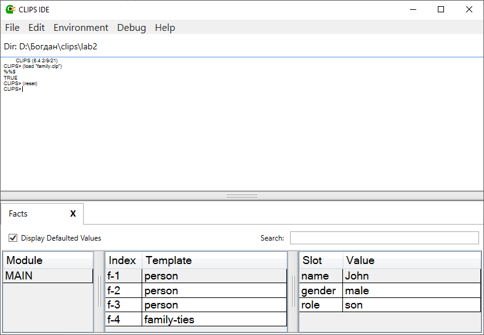
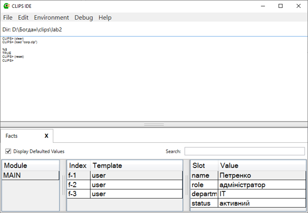

## 🧪 Лабораторна робота №2

**Тема:** Експертна система CLIPS.

### 📋 Завдання

1. **Завдання 1:** Перетворення текстових тверджень у факти та визначення моделей даних (`deftemplate`, `deffacts`).
   * Перетворити речення про родинні зв'язки (John, Tom, Susan) у факти `deffacts`.
   * Розробити відповідні шаблони `deftemplate` (`person`, `family-ties`) з обмеженнями на значення слотів.

2. **Завдання 2:** Моделювання системи управління користувачами організації.
   * Створити `deftemplate` для користувачів з атрибутами: ім'я користувача, роль, відділ, статус активності.
   * Створити факти `deffacts` для трьох користувачів: Петренко, Ковальчук, Іваненко.

---

### 💻 Код рішення

#### 1. Моделювання родинних зв'язків ([family.clp](family.clp))

```clips
(deftemplate person
   (slot name (type SYMBOL))
   (slot gender (allowed-values male female))
   (slot role (allowed-values father mother son)))

(deftemplate family-ties
   (slot father (type SYMBOL))
   (slot mother (type SYMBOL))
   (slot child (type SYMBOL))
   (multislot parents))

(deffacts family
   (person (name John) (gender male) (role son))
   (person (name Tom) (gender male) (role father))
   (person (name Susan) (gender female) (role mother))
   (family-ties (father Tom) (mother Susan) (child John) (parents Tom Susan)))

```

#### 2. Управління користувачами організації ([corp.clp](corp.clp))

```clips
(deftemplate user
   (slot name (type SYMBOL))
   (slot role (type SYMBOL))
   (slot department (type SYMBOL))
   (slot status (type SYMBOL) (allowed-values активний неактивний)))

(deffacts corporation
   (user (name Петренко) (role адміністратор) (department IT) (status активний))
   (user (name Ковальчук) (role менеджер) (department Маркетинг) (status неактивний))
   (user (name Іваненко) (role співробітник) (department HR) (status активний)))

```

---

### 📸 Скріншоти виконання

#### Завдання 1: Завантаження та перегляд фактів родинних зв'язків

#### Завдання 2: База фактів користувачів організації

---

### 📝 Висновки

Під час виконання лабораторної роботи №2 я навчився перетворювати текстові описи предметної області у формалізовані факти середовища CLIPS, розробляти узагальнені структури даних за допомогою `deftemplate` та задавати допустимі типи й значення слотів.
