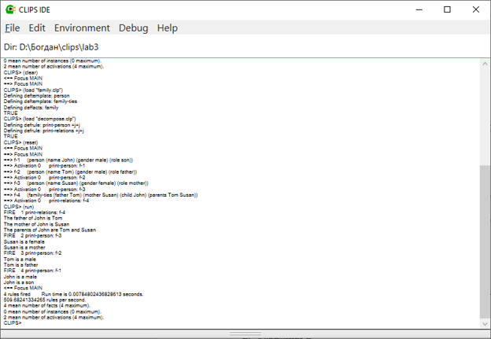
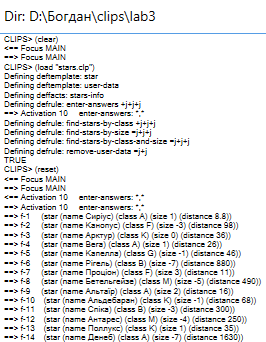
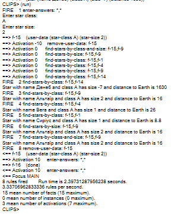

## 🧪 Лабораторна робота №3

**Тема:** Експертна система CLIPS.

### 📋 Завдання

1. **Завдання 1:** Виведення фактів за допомогою правил (`defrule`).
   * Реалізувати завдання з Лабораторної роботи №2 (родинні зв'язки) у вигляді правил `defrule`, які форматують та виводять текстові речення про осіб та родинні відношення.

2. **Завдання 2:** Пошукова система астрономічних об'єктів (зорей).
   * Створити шаблони `deftemplate` для зорі (`star`) та даних користувача (`user-data`).
   * База фактів `deffacts` має містити відомості про зоряні класи, величину та відстань до Землі для 14 відомих зорі.
   * Написати правила з пріоритетами виконання (`salience`) для інтерактивного введення параметрів користувачем (`read`) та пошуку зорі:
      * за спектральним класом;
      * за зоряною величиною (яскравістю);
      * за обома параметрами одночасно з виведенням відстані в світлових роках.

---

### 💻 Код рішення

#### 1. Виведення родинних зв'язків через правила ([decompose.clp](./decompose.clp))

```clips
(defrule print-person
   (person (name ?name) (gender ?gender) (role ?role))
   =>
   (printout t ?name " is a " ?gender crlf)
   (printout t ?name " is a " ?role crlf))

(defrule print-relations
   (family-ties (child ?child) (father ?father) (mother ?mother) (parents ?parent1 ?parent2))
   =>
   (printout t "The father of " ?child " is " ?father crlf)
   (printout t "The mother of " ?child " is " ?mother crlf)
   (printout t "The parents of " ?child " are " ?parent1 " and " ?parent2 crlf))
```

#### 2. Пошук та класифікація зорі ([stars.clp](lab3/stars.clp))

```clips
(deftemplate star
   (slot name (type SYMBOL))
   (slot class (type SYMBOL))
   (slot size (type INTEGER) (range -7 15))
   (slot distance (type NUMBER)))

(deftemplate user-data
   (slot star-class (type SYMBOL))
   (slot star-size (type INTEGER) (range -7 15)))

(deffacts stars-info
   (star (name Сиріус) (class A) (size 1) (distance 8.8))
   (star (name Канопус) (class F) (size -3) (distance 98))
   (star (name Арктур) (class K) (size 0) (distance 36))
   (star (name Вега) (class A) (size 1) (distance 26))
   (star (name Капелла) (class G) (size -1) (distance 46))
   (star (name Рігель) (class B) (size -7) (distance 880))
   (star (name Проціон) (class F) (size 3) (distance 11))
   (star (name Бетельгейзе) (class M) (size -5) (distance 490))
   (star (name Альтаїр) (class A) (size 2) (distance 16))
   (star (name Альдебаран) (class K) (size -1) (distance 68))
   (star (name Спіка) (class B) (size -3) (distance 300))
   (star (name Антарес) (class M) (size -4) (distance 250))
   (star (name Поллукс) (class K) (size 1) (distance 35))
   (star (name Денеб) (class A) (size -7) (distance 1630)))

(defrule enter-answers
   (declare (salience 10))
   (not (user-data))
   (not (done))
   =>
   (printout t "Enter star class:" crlf)
   (bind ?star-class (read))
   (printout t "Enter star size:" crlf)
   (bind ?star-size (read))
   (assert (user-data (star-class ?star-class) (star-size ?star-size))))

(defrule find-stars-by-class
   (user-data (star-class ?star-class))
   (star (class ?star-class) (name ?name) (size ?size) (distance ?distance))
   =>
   (printout t "Star with name " ?name " and class " ?star-class " has size " ?size " and distance to Earth is " ?distance crlf))

(defrule find-stars-by-size
   (user-data (star-size ?star-size))
   (star (class ?class) (name ?name) (size ?star-size) (distance ?distance))
   =>
   (printout t "Star with name " ?name " and class " ?class " has size " ?star-size " and distance to Earth is " ?distance crlf))

(defrule find-stars-by-class-and-size
   (user-data (star-class ?star-class) (star-size ?star-size))
   (star (class ?star-class) (name ?name) (size ?star-size) (distance ?distance))
   =>
   (printout t "Star with name " ?name " and class " ?star-class " has size " ?star-size " and distance to Earth is " ?distance crlf))

(defrule remove-user-data
   (declare (salience -10))
   ?fact <- (user-data)
   =>
   (retract ?fact)
   (assert (done)))
```

---

### 📸 Скріншоти виконання

#### Завдання 1: Виконання правил для виведення речень з фактів


#### Завдання 2.1: Завантаження та ініціалізація програми пошуку зорі


#### Завдання 2.2: Консольне введення параметрів та результати пошуку

---

### 📝 Висновки

Під час виконання лабораторної роботи №3 я навчився перетворювати факти у текстові вирази за допомогою продукційних правил `defrule`, керувати порядком виконання правил через параметр пріоритету `salience`, а також розробив програму для інтерактивного пошуку зорі за параметрами спектрального класу та зоряної величини.