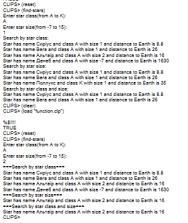

## 🧪 Лабораторна робота №4

**Тема:** Функції в CLIPS.

### 📋 Завдання

1. **Модернізація системи класифікації та пошуку зорі з використанням `deffunction`**`:
   * Переробити експертну систему з Лабораторної роботи №3, замінивши продукційні правила пошуку на спеціалізовані користувацькі функції.
   * Створити окремі функції для ітеративної обробки бази фактів за допомогою макросу `do-for-all-facts`:
      * `find-stars-by-class`: пошук за спектральним класом;
      * `find-stars-by-size`: пошук за зоряною величиною (яскравістю);
      * `find-stars-by-class-and-size`: пошук за комбінацією двох параметрів.
   * Створити головну керуючу функцію `find-stars`, яка запитує дані від користувача та послідовно викликає функції пошуку.
---

### 💻 Код рішення

#### Головний модуль із функціями та фактами ([function.clp](./function.clp))

```clips
(deftemplate star
   (slot name (type SYMBOL))
   (slot class (type SYMBOL))
   (slot size (type INTEGER) (range -7 15))
   (slot distance (type NUMBER)))

(deffacts stars-info
   (star (name Сиріус) (class A) (size 1) (distance 8.8))
   (star (name Канопус) (class F) (size -3) (distance 98))
   (star (name Арктур) (class K) (size 0) (distance 36))
   (star (name Вега) (class A) (size 1) (distance 26))
   (star (name Капелла) (class G) (size -1) (distance 46))
   (star (name Рігель) (class B) (size -7) (distance 880))
   (star (name Проціон) (class F) (size 3) (distance 11))
   (star (name Бетельгейзе) (class M) (size -5) (distance 490))
   (star (name Альтаїр) (class A) (size 2) (distance 16))
   (star (name Альдебаран) (class K) (size -1) (distance 68))
   (star (name Спіка) (class B) (size -3) (distance 300))
   (star (name Антарес) (class M) (size -4) (distance 250))
   (star (name Поллукс) (class K) (size 1) (distance 35))
   (star (name Денеб) (class A) (size -7) (distance 1630)))

(deffunction find-stars-by-class (?star-class)
   (printout t "=== Search by star class ===" crlf)
   (do-for-all-facts ((?i star)) (eq ?i:class ?star-class)
      (printout t "Star has name " ?i:name " and class " ?i:class " with size " ?i:size " and distance to Earth is " ?i:distance crlf)))

(deffunction find-stars-by-size (?star-size)
   (printout t "=== Search by star size ===" crlf)
   (do-for-all-facts ((?i star)) (eq ?i:size ?star-size)
      (printout t "Star has name " ?i:name " and class " ?i:class " with size " ?i:size " and distance to Earth is " ?i:distance crlf)))

(deffunction find-stars-by-class-and-size (?star-class ?star-size)
   (printout t "=== Search by star class and size ===" crlf)
   (do-for-all-facts ((?i star)) (and (eq ?i:class ?star-class) (eq ?i:size ?star-size))
      (printout t "Star has name " ?i:name " and class " ?i:class " with size " ?i:size " and distance to Earth is " ?i:distance crlf)))

(deffunction find-stars ()
   (printout t "Enter star class (from A to K):" crlf)
   (bind ?star-class (read))
   (printout t "Enter star size (from -7 to 15):" crlf)
   (bind ?star-size (read))
   (find-stars-by-class ?star-class)
   (find-stars-by-size ?star-size)
   (find-stars-by-class-and-size ?star-class ?star-size))
```
---

### 📸 Скріншоти виконання

#### Виконання пошуку для класу 'A' та величини '1'


---

### 📝 Висновки

Під час виконання лабораторної роботи №4 я реалізував експертну систему з використанням користувацьких функцій `deffunction` та макросу ітерації фактів `do-for-all-facts`. Було розділено логіку запиту параметрів від користувача та безпосередній пошук інформації в базі фактів за критеріями, що зробило структуру програми більш модульною та процедурно керованою.

---
