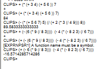
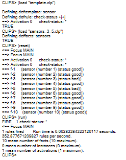
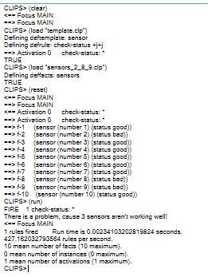
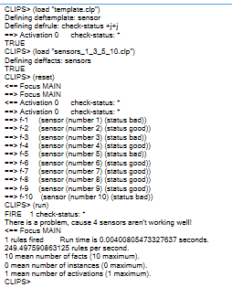

## 🧪 Лабораторна робота №5

**Тема:** Експертна система CLIPS.

### 📋 Завдання

1. **Загальне завдання (Арифметика в CLIPS)**:
   * Перетворити інфіксні математичні вирази у префіксні нотації (LISP-подібний синтаксис CLIPS) та обчислити їх результати в середовищі:

      * a) $(3+4)*(5+6)+7$
      * б) $(5*(5+6+7))-((3*(4/9)+2)/8)$ 
      * в) $5-9*8/3+4-(8-2-3)*6/7$

2. **Індивідуальне завдання (Моніторинг датчиків)**:
   * На промисловій установці є 10 датчиків (ID 1-10) зі станом `good` або `bad`.
   * Створити `deftemplate` для представлення стану датчиків.
   * Написати правило `check-status`, яке виводить попередження, якщо 3 або більше датчиків несправні (`bad`).
   * Протестувати правило на трьох наборах даних:
      * Датчики 3 та 5 несправні (2 несправних).
      * Датчики 2, 8 та 9 несправні (3 несправних).
      * Датчики 1, 3, 5 та 10 несправні (4 несправних).

---

### 💻 Код рішення

#### 1. Префіксні вирази CLIPS ([arithmetic.clp](./arithmetic.clp))

```clips
;; а) (3+4)*(5+6)+7
(+ (* (+ 3 4) (+ 5 6)) 7)

;; б) (5*(5+6+7))-((3*(4/9)+2)/8)
(- (* 5 (+ 5 6 7)) (/ (+ (* 3 (/ 4 9)) 2) 8))

;; в) 5-9*8/3+4-(8-2-3)*6/7
(+ (- 5 (* 9 (/ 8 3))) (- 4 (* (- 8 2 3) (/ 6 7))))
```

#### 2. Шаблон та правило перевірки датчиків ([template.clp](./sensors/template.clp))

```clips
(deftemplate sensor
   (slot number (type INTEGER) (range 0 ?VARIABLE))
   (slot status (allowed-values good bad)))

(defrule check-status
   =>
   (bind ?count (find-all-facts ((?i sensor)) (eq ?i:status bad)))
   (bind ?len (length$ ?count))
   (if (>= ?len 3)
      then
      (printout t "There is a problem, cause " ?len " sensors aren't working well!" crlf)))
```

#### 3. Приклад тестового набору ([sensors_2_8_9.clp](./sensors/sensors_2_8_9.clp))

```clips
(deffacts sensors
   (sensor (number 1) (status good))
   (sensor (number 2) (status bad))
   (sensor (number 3) (status good))
   (sensor (number 4) (status good))
   (sensor (number 5) (status good))
   (sensor (number 6) (status good))
   (sensor (number 7) (status good))
   (sensor (number 8) (status bad))
   (sensor (number 9) (status bad))
   (sensor (number 10) (status good)))
```
#### *Інші тестові набори [sensors_3_5.clp](./sensors/sensors_3_5.clp) та [sensors_1_3_5_10.clp](./sensors/sensors_1_3_5_10.clp)*
---

### 📸 Скріншоти виконання

#### Завдання 1: Обчислення арифметичних префіксних виразів


#### Завдання 2: Тест 1 (несправні 3, 5 — попередження відсутнє)


#### Завдання 2: Тест 2 (несправні 2, 8, 9 — спрацювання попередження)


#### Завдання 2: Тест 3 (несправні 1, 3, 5, 10 — спрацювання попередження)

---

### 📝 Висновки

Під час виконання лабораторної роботи №5 я навчився перетворювати інфіксні математичні вирази у префіксну форму CLIPS та виконувати їх обчислення. Також була розроблена система моніторингу датчиків з використанням шаблонів `deftemplate`, правил та функції `find-all-facts` для агрегації фактів та виведення критичних сповіщень при перевищенні ліміту несправностей.

---
